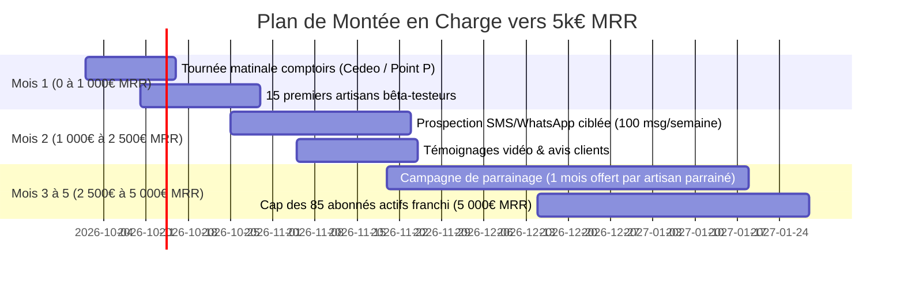

# 🚀 Plan d'Acquisition & Vente Terrain — Objectif 5 000 € / mois (5k MRR)
## SaaS : Devis Minute BTP (59 € HT / mois par artisan)

---

## 🎯 1. Modèle Mathématique pour atteindre les 5 000 € de MRR

| Métrique | Objectif Moyen (Mensuel) | Objectif Annuel (Cash Flow Immédiat) |
| :--- | :--- | :--- |
| **Prix de l'abonnement** | 59 € HT / mois | 590 € HT / an (2 mois offerts) |
| **Nombre d'abonnés requis** | **85 artisans actifs** | **100 artisans annuels** = **59 000 € de trésorerie** |
| **Rythme d'acquisition cible** | **4 nouveaux artisans / semaine** | Atteinte des 5k MRR en **5 à 6 mois** |
| **Taux d'attrition (Churn) estimé** | < 3% (L'artisan conserve ses devis, acomptes et factures) | LTV estimée > 1 400 € par artisan |

---

## ☕ PILIER 1 : La Stratégie des Comptoirs de Négoce (6h45 - 8h15)

### 📍 Où et quand prospecter ?
Les artisans du BTP ne répondent pas aux emails froids et ne sont pas sur LinkedIn pendant la journée. Leur seul point de passage fixe et récurrent est le **comptoir des distributeurs professionnels de matériaux** entre **6h45 et 8h15 du matin**, pendant qu'ils attendent leur commande et boivent un café :
- **Plomberie / Chauffage** : Cedeo, Richardson, Tereva, Pum Plastiques.
- **Électricité / Climatisation** : Rexel, Sonepar.
- **Gros œuvre & Second œuvre** : Point.P, La Plateforme du Bâtiment, BigMat.

---

### 🗣️ Le Pitch d'Accroche Terrain (15 secondes chrono)

> **Vous** : *« Bonjour ! Dites-moi, vous passez encore vos soirées à 21h sur votre ordinateur à retaper vos devis de la journée ? »*
> 
> **L'Artisan** : *« Ah oui... c'est la galère, je rentre crevé et j'ai encore 2h de paperasse. »*
> 
> **Vous** : *« Regardez, donnez-moi un dépannage ou un chantier classique que vous faites souvent (ex: changement de chauffe-eau ou remplacement de tableau). Je vous le chiffre et je fais signer le client sur smartphone en 25 secondes chrono. Montre en main. »*

---

### 📱 La Démo Live "Effet WAOUH" (30 secondes)
1. **Ouvrir l'application sur votre smartphone** : `https://devis-minute-btp.vercel.app/`
2. **Appuyer sur le micro (Dictée Vocale IA)** :
   *« Remplacement chauffe-eau 250 litres blindé, 3 heures de main d'oeuvre et forfait déplacement, acompte 30% »*.
3. **Montrer l'écran instantanément rempli** : Le prix, la TVA à 10%, l'acompte de 30% et le montant TTC sont calculés.
4. **Appuyer sur "Faire signer"** : Vous lui faites faire un gribouillis avec le doigt.
5. **Appuyer sur "Encaisser Acompte"** : Afficher le **QR Code de paiement CB / Apple Pay**.
6. **Conclusion** : *« Voilà : devis signé, mentions légales décennales intégrées, acompte de 350€ sur votre compte avant même d'avoir rangé vos tournevis dans la camionnette. Vos soirées sont libres. »*

---

### 📇 Le Support Terrain : La "Carte-Chantier" Flash
Ne donnez jamais de plaquette commerciale de 4 pages qui finira à la poubelle. Donnez une carte rigide format carte de visite avec :
- **Recto** : *« Fini les devis à 21h. Chiffrez à la voix, faites signer sur place, encaissez l'acompte en 30s. »*
- **Verso** : **QR Code géant** redirigeant directement vers la démo interactive sans téléchargement + Mention : *« 14 jours d'essai gratuit offert »*.

---

## 💬 PILIER 2 : Scripts WhatsApp & SMS à Fort Taux de Réponse

### 📲 Script 1 : Dépannage Urgent (Plombiers, Électriciens, Serruriers)
*Cible : Artisans indépendants trouvés sur Google Maps / PagesJaunes / Leboncoin.*

```text
Bonjour [Prénom/Entreprise],

Petite question rapide entre pros : ça vous arrive souvent d'aller faire un dépannage en urgence, d'envoyer le devis le soir... et que le client ne donne plus signe de vie ou refuse de verser l'acompte ?

On a conçu une appli mobile simple pour les dépanneurs :
👉 Vous dictez vos fournitures à la voix sur place (15s)
👉 Le client signe directement sur votre écran
👉 Vous encaissez l'acompte de 30% par CB / Apple Pay avant d'attaquer les travaux

Testez la démo en 1 clic sans rien installer (14 jours offerts) :
https://devis-minute-btp.vercel.app/

Bonne journée et bon courage sur vos chantiers !
Maxence — Devis Minute BTP (06 XX XX XX XX)
```

---

### 📲 Script 2 : Rénovateurs & Artisans Second-Œuvre (Gros Chantiers)

```text
Bonjour [Nom de l'artisan],

Je vois vos belles réalisations sur [Instagram/Facebook/Google]. 

Combien d'heures passez-vous chaque semaine sur Excel ou Word le dimanche soir pour sortir vos devis détaillés ?

Avec Devis Minute BTP :
1. Vous ajoutez vos ouvrages en 1 clic (peinture m², sanitaires, cloisons)
2. Vos mentions décennales et TVA (10% / 5.5%) sont 100% conformes
3. Export automatique pour votre expert-comptable en fin de mois (Sage/Pennylane/Excel)

Essayez gratuitement sur votre téléphone :
👉 https://devis-minute-btp.vercel.app/

Si vous voulez, envoyez-moi votre tarif habituel et je vous configure votre catalogue sur-mesure gratuitement aujourd'hui.
```

---

### 🎬 Scénario de la Mini-Vidéo Démo (20 secondes — Format TikTok / Reels / WhatsApp Status)

| Timing | Visuel (Caméra sur smartphone en main) | Voix-Off / Texte incrusté |
| :--- | :--- | :--- |
| **0 - 3s** | Gros plan sur un artisan dans sa camionnette, outils en main. | *« Comment je fais signer un devis à 1 200€ avant de démarrer ma camionnette ? »* |
| **3 - 8s** | Clic sur le gros micro jaune. Dictée : *"Changement ballon d'eau chaude 200L + 2h de pose"*. | *« Je dicte à la voix... l'IA calcule tout le devis avec la TVA à 10%. »* |
| **8 - 14s** | Le client signe avec son pouce sur l'écran. | *« Le client valide et signe sur mon écran en 5 secondes. »* |
| **14 - 18s** | Le client approche son iPhone pour scanner le QR Code CB/Apple Pay. Pluie de confettis. | *« Acompte de 30% encaissé instantanément. Zéro impayé. »* |
| **18 - 20s** | Logo Devis Minute BTP + Lien. | *« Fini les soirées paperasse. Testez 14 jours gratuits sur devis-minute-btp.fr »* |

---

## 🎁 PILIER 3 : L'Offre de Lancement Irrésistible "Club des 50 Pionniers BTP"

Pour lever **100% des objections** lors du lancement, l'offre ne doit pas être "un simple abonnement logiciel", mais une **solution clé en main où l'artisan n'a aucun effort à faire** :

### 💎 Le Package "Pionnier Pro BTP" (59 € / mois sans engagement)
1. **14 Jours d'Essai Gratuit Complet** (Sans carte bancaire obligatoire à l'inscription).
2. **Setup VIP Offert (Valeur 200 €)** :
   * L'artisan envoie une photo de son ancien devis papier ou de ses tarifs par WhatsApp.
   * Vous lui intégrez son catalogue complet de prestations, son logo, son SIRET et son assurance décennale en **moins de 24h**.
   * Résultat : Le premier jour où il allume l'app, tout est prêt pour ses chantiers.
3. **Garantie "3 Chantiers Signés ou Remboursé"** :
   * *« Si vous ne signez pas au moins 3 devis plus rapidement le premier mois, on vous rembourse l'abonnement intégralement. »*
4. **Option Annuelle VIP (590 € HT / an - soit 2 mois gratuits)** :
   * Permet d'encaisser immédiatement **590 € de cash** par artisan signataire pour financer vos campagnes de pub locales ou rémunérer un commercial terrain.

---

## 🗓️ Plan d'Action Semaine par Semaine (Mois 1 $\rightarrow$ Mois 3)



---

## 💡 Le Levier du Parrainage Artisans (Bouche-à-Oreille)
Dans le BTP, les artisans travaillent constamment ensemble en sous-traitance ou en co-activité (le plombier travaille avec le carreleur et l'électricien) :
* **Règle de Parrainage intégrée** : *« Pour chaque confrère artisan parrainé qui rejoint Devis Minute BTP, 1 mois d'abonnement offert pour vous et 1 mois pour votre confrère. »*
* Avec 20 artisans convaincus, le système génère naturellement 10 à 15 nouveaux abonnés par mois sans coût d'acquisition supplémentaire.
